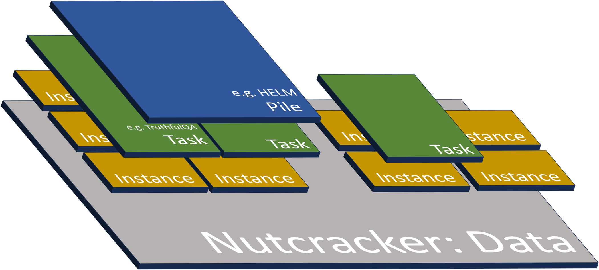

# Nutcracker - Large Model Evaluations and Experiments

like LM-Eval-Harness but without PyTorch madness. Bring-your-own-API + straightforward data management


https://github.com/brucewlee/nutcracker/assets/54278520/151403fc-217c-486c-8de6-489af25789ce


---

# Installation

### Route 1. PyPI (Do not use for now)
**Install Nutcracker**
```bash
pip install nutcracker-py
```

**Download Nutcracker DB**
```bash
git clone https://github.com/walnut-research/nutcracker-db
```

### Route 2. GitHub
**Install Nutcracker**         
```bash
git clone https://github.com/walnut-research/nutcracker
pip install -e nutcracker
```

**Download Nutcracker DB**
```bash
git clone https://github.com/walnut-research/nutcracker-db
```

Check all tasks implemented in [Nutcracker DB](https://github.com/walnut-research/nutcracker-db)'s readme page.

---

# QuickStart
### Case Study: Evaluate (Any) LLM API on TruthfulQA ([Script](nutcracker/demos/demo-readme1.py))
##### STEP 1: Define Model
- Define a simple model class with a "*respond(self, user_prompt)*" function. 
- We will use OpenAI here. But really, any api can be evaluated if the "*respond(self, user_prompt)*" function that returns LLM response in string exists. Get creative (Hugginface API, Anthropic API, Replicate API, OLLaMA, and etc.)
```python
from openai import OpenAI
import os, logging, sys
logging.basicConfig(level=logging.INFO)
logging.getLogger('httpx').setLevel(logging.CRITICAL)
os.environ["OPENAI_API_KEY"] = ""
client = OpenAI()

class ChatGPT:
    def __init__(self):
        self.model = "gpt-3.5-turbo"

    def respond(self, user_prompt):
        response_data = None
        while response_data is None:
            try:
                completion = client.chat.completions.create(
                    model=self.model,
                    messages=[
                        {"role": "user", "content": f"{user_prompt}"}
                    ],
                    timeout=15,
                )
                response_data = completion.choices[0].message.content
                break
            except KeyboardInterrupt:
                sys.exit()
            except:
                print("Request timed out, retrying...")
        return response_data
```
##### STEP 2: Run Evaluation
```python
from nutcracker.data import Task, Pile
from nutcracker.runs import Schema
from nutcracker.evaluator import MCQEvaluator, generate_report

# this db_directory value should work off-the-shelf if you cloned both repositories in the same directory
truthfulqa = Task.load_from_db(task_name='truthfulqa-mc1', db_directory='nutcracker-db/db')

# sample 20 for demo
truthfulqa.sample(20, in_place=True)

# running this experiment updates each instance's model_response property in truthfulqa data object with ChatGPT responses
experiment = Schema(model=ChatGPT(), data=truthfulqa)
experiment.run()

# running this evaluation updates each instance's response_correct property in truthfulqa data object with evaluations
evaluation = MCQEvaluator(data=truthfulqa)
evaluation.run()

for i in range (0, len(truthfulqa)):
    print(truthfulqa[i].user_prompt)
    print(truthfulqa[i].model_response)
    print(truthfulqa[i].correct_options)
    print(truthfulqa[i].response_correct)
    print()

print(generate_report(truthfulqa, save_path='accuracy_report.txt'))
```

---

### Case Study: Task vs. Pile? Evaluating LLaMA on MMLU ([Script](nutcracker/demos/demo-readme2.py))
##### STEP 1: Understand the basis of Nutcracker
- Despite our lengthy history of model evaluation, my understanding of the field is that we have not reached a clear consensus on what a "benchmark" is (*Is MMLU a "benchmark"? Is Huggingface Open LLM leaderboard a "benchmark"?*). 
- Instead of using the word benchmark, Nutcracker divides the data structure into Instance, Task, and Pile (See blog post: [HERE](https://brucewlee.medium.com/nutcracker-instance-task-pile-38f646c1b36d))
- Nutcracker DB is constructed on the Task-level but you can call multiple Tasks together on the Pile-level.
<p align="center">

</p>

##### STEP 2: Define Model
- Since we've tried OpenAI API above, let's now try Hugginface Inference Endpoint. Most open-source models are accessible through this option. (See blog post: [HERE](https://brucewlee.medium.com/nutcracker-evaluating-on-huggingface-inference-endpoints-6e977e326c5b))

```python
class LLaMA:
    def __init__(self):
        self.API_URL = "https://xxxx.us-east-1.aws.endpoints.huggingface.cloud"

    def query(self, payload):
        headers = {
            "Accept" : "application/json",
            "Authorization": "Bearer hf_XXXXX",
            "Content-Type": "application/json" 
        }
        response = requests.post(self.API_URL, headers=headers, json=payload)
        return response.json()

    def respond(self, user_prompt):
        output = self.query({
            "inputs": f"<s>[INST] <<SYS>> You are a helpful assistant. You keep your answers short. <</SYS>> {user_prompt}",
        })
        return output[0]['generated_text']
```

##### STEP 3: Load Data
```python
from nutcracker.data import Pile
import logging
logging.basicConfig(level=logging.INFO)

mmlu = Pile.load_from_db('mmlu','nutcracker-db/db')
```

##### STEP 4: Run Experiment (Retrieve Model Responses)
- Running evaluation updates each instance's *model_response* attribute within the data object, which is mmlu Pile in this case.
- You can save data object at any step of the evaluation. Let's try saving this time to prevent API requesting again in case anything happens.

```python
from nutcracker.runs import Schema
mmlu.sample(n=1000, in_place = True)

experiment = Schema(model=LLaMA(), data=mmlu)
experiment.run()
mmlu.save_to_file('mmlu-llama.pkl')
```
- You can load and check how the model responded.

```python
loaded_mmlu = Pile.load_from_file('mmlu-llama.pkl')
for i in range (0,len(loaded_mmlu)):
    print("\n\n\n---\n")
    print("Prompt:")
    print(loaded_mmlu[i].user_prompt)
    print("\nResponses:")
    print(loaded_mmlu[i].model_response)
```

##### STEP 5: Run Evaluation
- LLMs often don’t respond in immediately recognizable letters like A, B, C, or D. 
- Therefore, Nutcracker supports an intent-matching feature (requires OpenAI API Key) that parses model response to match discrete labels, but let’s disable that for now and proceed with our evaluation.
- We recommend using intent-matching for almost all use cases. We will publish a detailed research later.

```python
from nutcracker.evaluator import MCQEvaluator, generate_report
evaluation = MCQEvaluator(data=loaded_mmlu, disable_intent_matching=True)
evaluation.run()
print(generate_report(loaded_mmlu, save_path='accuracy_report.txt'))
```


https://github.com/brucewlee/nutcracker/assets/54278520/6deb5362-fd48-470e-9964-c794425811d9


---

# Tutorials
- Evaluating on HuggingFace Inference Endpoints -> [HERE / Medium](https://brucewlee.medium.com/nutcracker-evaluating-on-huggingface-inference-endpoints-6e977e326c5b)
- Understanding Instance-Task-Pile -> [HERE / Medium](https://brucewlee.medium.com/nutcracker-instance-task-pile-38f646c1b36d)
